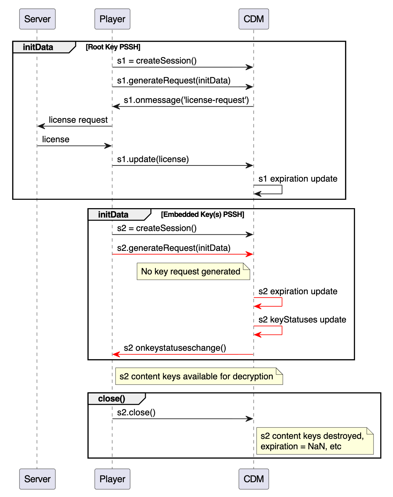
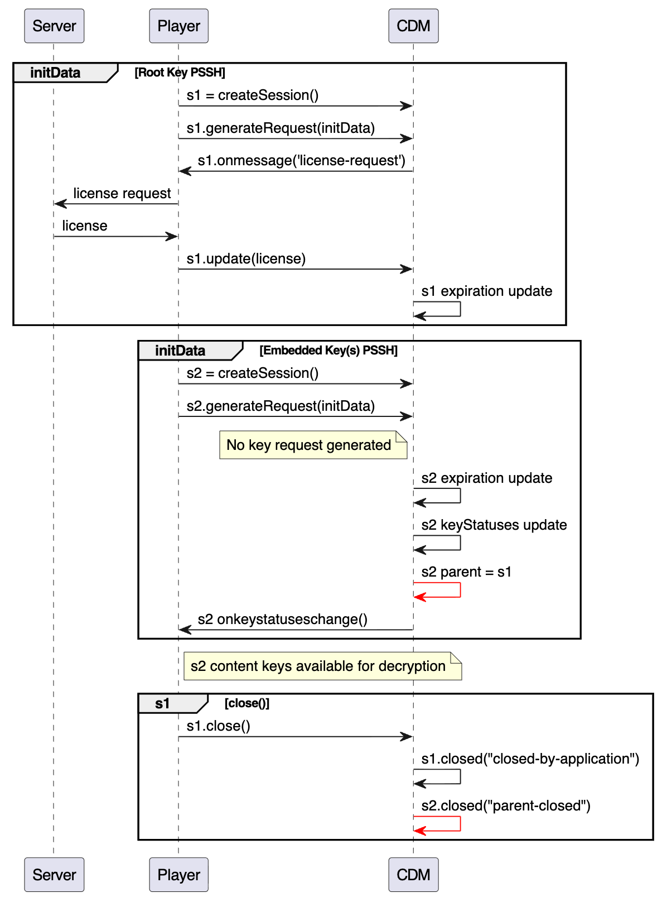
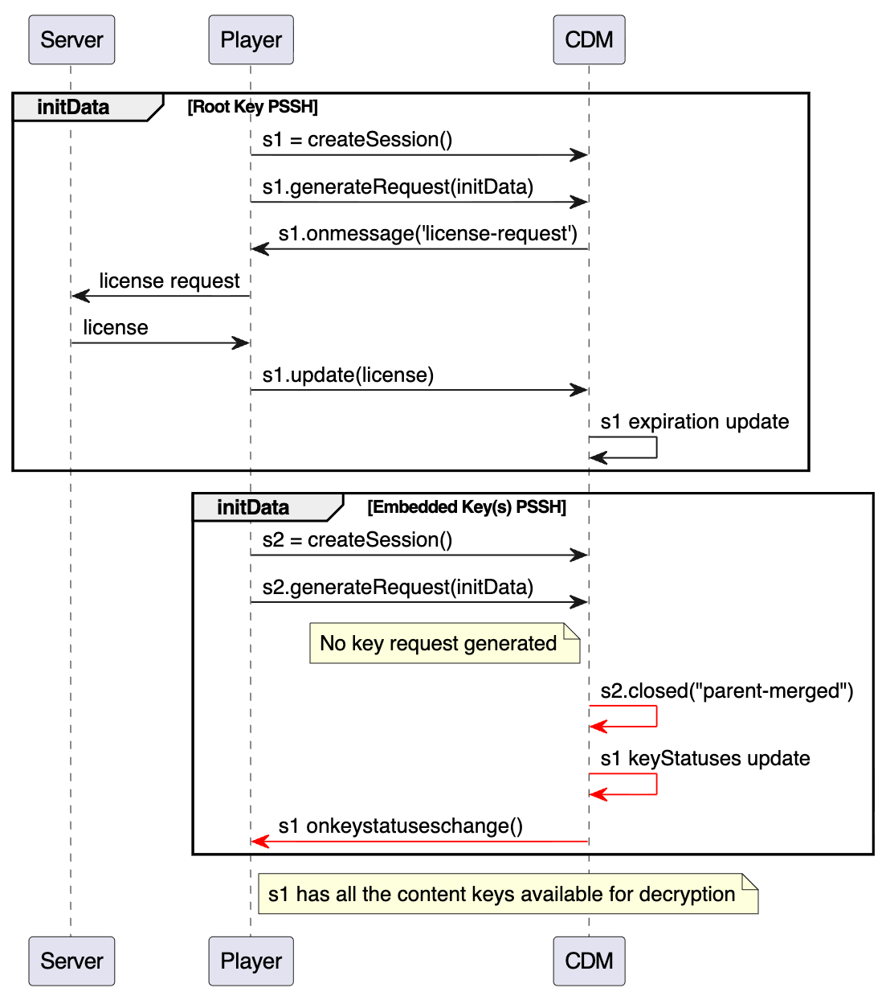
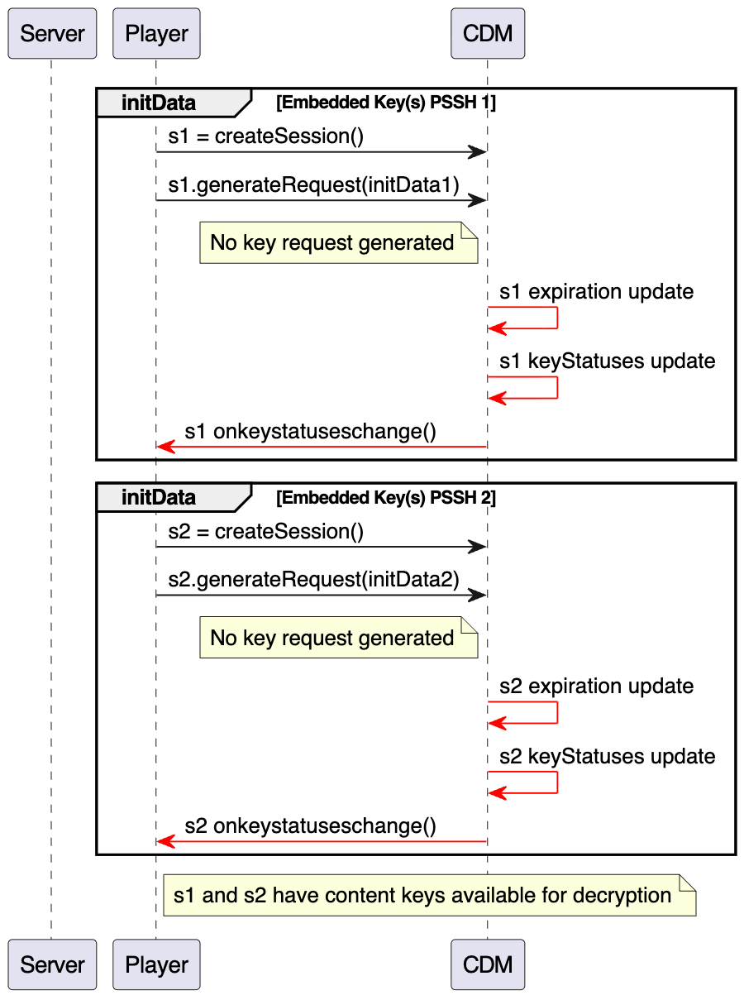

# Embedded Keys and Key Rotation Support in EME

# Abstract

Embedded Keys, a crucial technique for key rotation and widely adopted in the streaming industry for operational efficiency and security, are supported within the MPEG Common Encryption Specification. However, this functionality is currently absent from the EME specification. While discussions regarding the inclusion of embedded keys and key rotation in EME took place approximately a decade ago, no consensus was reached. This explainer aims to describe this feature and its applications, summarize prior discussions, and propose an update to the EME specification to facilitate support for embedded keys and key rotation.

# Background

## Embedded Keys in MPEG Common Encryption Spec

MPEG Common Encryption Spec (23001-7, 8.1.1) specifically mentioned supporting embedded keys in the `ProtectionSystemSpecificHeaderBox` (PSSH):

> “PSSH is allowed to be in the `Movie` (‘moov’) or `Movie Fragment` (‘moof’) boxes”.  

> “The data encapsulated in the Data field may be read by the identified content protection system client to enable decryption key acquisition and decryption of media data. For license/rights-based systems, the header information may include data such as the URL of license server(s) or rights issuer(s) used, embedded licenses/rights, **embedded keys(s)**, and/or other protection system specific metadata”.

One common example of **embedded keys** is to have encrypted content keys in the `Movie Fragment` (‘moof’) PSSH. As long as the client, e.g. Content Decryption Module (CDM), can decrypt the content keys, these PSSHs can be directly used by the client to decrypt and play content. This approach is a shift from the traditional model where separate license requests are needed for new content keys.

The use of embedded keys is a common mechanism to enable secure and efficient **key rotation**, where the content key changes during media playback. Cable and cellular networks require this capability to enforce re-authorization over multicast and broadcast systems. Without embedded keys, key rotation would trigger millions of simultaneous license requests, creating a 'thundering herd' of client traffic and severe server spikes. This scalability challenge was a primary driver for the first amendment of the MPEG Common Encryption Specification (*ISO/IEC 23001-7:2012 Amendment 1: AES-CBC-128 and key rotation*), which allows the ‘pssh’ box to be included within the movie fragment box.

## Root Key and Embedded Key

For this discussion of Encrypted Media Extensions (EME), we will use a simplified, hierarchical key model featuring two key types: **root key** and **embedded key**. While implementation details of embedded keys may vary, these differences do not impact the general principles of the EME discussion.

* **Root Key:** This is typically a longer-lived key that is used to encrypt the content key. It is delivered securely to the CDM, before or at the beginning of a playback session.
* **Embedded Key:** These are ephemeral, short-lived, encrypted content keys used to decrypt the actual media stream.

The delivery of Root Key varies depending on the platform and key system. Common examples include:

* Baked into the client. The client can play the content without any requests to a server.  
* Acquired by the client via a separate channel outside of the EME workflow.  
* Acquired by the client via EME license request at the beginning of the playback.

## Typical Workflow of Embedded Keys

1. **Packaging:** The Content Keys used to encrypt the media, are themselves encrypted with a Root Key. These encrypted Content Keys are then embedded directly in the media stream, e.g. within the `Movie Fragment` (‘moof’) PSSH boxes.  
2. **Root Key Acquisition:** See above for Root Key delivery. It may be baked in the client, fetched via a side channel, or acquired using the EME license request flow. The Root Key is then loaded into the CDM.
3. **Playback:** As the media plays, the embedded key PSSH is provided to the CDM, which then uses the Root Key to decrypt the Content Keys. This process does not require any further license requests.

## Advantages of Using Embedded Keys For Key Rotation

* **Performance:** By eliminating the need for a network round-trip for every new key, this model prevents playback stutter and stalls, which is critical for live sports and dynamic ad insertion.  
* **Efficiency:** This model avoids the license storm with sharp server load spike when the content key rotates during live streaming events.

## Issues with the Current EME spec

EME currently doesn’t support embedded keys because it prohibits providing `Initialization Data` (PSSH) to the CDM except to generate a license request. To support this feature, EME must allow for initialization data to be provided to the CDM without generating a key request. See [https://github.com/w3c/encrypted-media/issues/41](https://github.com/w3c/encrypted-media/issues/41).

Here is a non-exhaustive list of definitions and algorithms that’s incompatible with embedded keys:

* [**Key**](https://www.w3.org/TR/encrypted-media-2/#dfn-key-s): … key refers to a decryption key that can be used to decrypt blocks within media data… Such keys **MUST only be provided to the CDM via an update() call**.  
* [**Initialization Data**](https://www.w3.org/TR/encrypted-media-2/#dfn-initialization-data): Initialization Data is a generic term for container-specific data that is used by a [CDM](https://www.w3.org/TR/encrypted-media-2/#dfn-cdm) **to generate a license request**.  
* [**generateRequest()**](https://www.w3.org/TR/encrypted-media-2/#dom-mediakeysession-generaterequest)**:** Generates a license request based on the initData. A [message](https://www.w3.org/TR/encrypted-media-2/#dfn-message) of type "[license-request](https://www.w3.org/TR/encrypted-media-2/#dom-mediakeymessagetype-license-request)" or "[individualization-request](https://www.w3.org/TR/encrypted-media-2/#dom-mediakeymessagetype-individualization-request)" **will always be queued** if the algorithm succeeds and the promise is resolved.

## Previous Discussions

Nearly a decade ago, around 2015, the EME community actively debated supporting embedded keys and continuous key rotation. However, due to differing opinions and urgent stabilization timelines, no consensus was reached. This document leverages valuable excerpts and summaries from that period.

* Update algorithms to reflect keys being provided in the Initialization Data: https://github.com/w3c/encrypted-media/issues/41
* Allow for long-lived key encryption keys (aka "master" keys) to increase performance: https://github.com/w3c/encrypted-media/issues/53
* Initialization Data Encountered Algorithm: 'encrypted' event should not be fired if there is no action to be taken: https://github.com/w3c/encrypted-media/issues/121 
* EME should support continuous key rotation per MPEG Common Encryption (ISO/IEC 23001-7): https://github.com/w3c/encrypted-media/issues/132

## Requirements

* **Compatibility**: Existing applications will continue to work and will support embedded keys with no or minimal change.  
* **Simplicity**: Application logic should be simple to support embedded keys.  
* **Interoperability**: Interoperable with key rotation features in different key systems, e.g. PlayReady [License Chaining](https://learn.microsoft.com/en-us/playready/overview/license-chaining).

# Proposals

## Relax generateRequest()

generateRequest() should allow processing initData without generating a new request. For initData containing embedded keys, the CDM can decrypt the content key directly, and then [Update Key Statuses](https://www.w3.org/TR/encrypted-media-2/#dfn-update-key-statuses).

### **Workflow**

* The application always creates a new session when hitting a new initData.  
* The application handles any key request generated, but doesn’t always expect one.  
* According to [Joey Parrish](mailto:joeyparrish@google.com), the EME spec editor and Shaka Player owner, most JavaScript applications don’t track the pair of `generateRequest()` and the key message. So `generateRequest()` not generating a message should be compatible with existing JavaScript players.

## Session Dependency and Management

The root key's management by s1 raises a concern: if s1 is destroyed or closed, the content keys it manages (e.g., those managed by s2) could become unusable. However, in the current EME spec, when a [session is closed](https://www.w3.org/TR/encrypted-media-2/#session-closed):
> “Keys in other sessions MUST be unaffected, even if they have overlapping key IDs”.

To solve this issue, we propose to introduce a new parent-child model for MediaKeySessions: when a parent session is closed, it’s expected that all child sessions will be closed as well:

* Add a new attribute `readonly attribute MediaKeySession.parent`
  * Will  be null if there’s no root key session, e.g. no embedded keys, or the root key is baked in the client.
  * Pointing to the MediaKeySession containing the root key.
  * Help track the root key session and embedded key session relationship.
  * Help prevent the root key session from being destroyed accidentally. 
* Add a new [MediaKeySessionClosedReason](https://www.w3.org/TR/encrypted-media-2/#dom-mediakeysessionclosedreason): “parent-closed”  
  * If the parent session is closed, all children sessions will be closed with reason “parent-closed”.

Instead of `s1.close()`, if s1’s reference is dropped, s1 will not be destructed, because it’s still being referenced by s2 via `s2.parent`.

## Single Session Mode

There are CDM implementations which manage the root key and embedded keys in the same session. In this case, as part of `generateRequest()`, the CDM will close a child session with a new [MediaKeySessionClosedReason](https://www.w3.org/TR/encrypted-media-2/#dom-mediakeysessionclosedreason) enum value: “parent-merged”, and merge it into the parent session.

> [!NOTE]
> "Single Session Mode" is provided solely for backward compatibility with legacy CDMs. Use of this mode is discouraged. Key Systems SHOULD support the management of root keys and embedded keys in separate sessions.

## Root Key Baked in the Client

When the root key is baked in the client, or acquired via a side channel, embedded key PSSHs will be accepted by the CDM without generating any key request.

## Summary of EME Spec Changes

* Relax `generateRequest()` to allow processing initData without generating a new request.  
* Add a new attribute `readonly attribute MediaKeySession.parent`  
* Add new [`MediaKeySessionClosedReason`](https://www.w3.org/TR/encrypted-media-2/#dom-mediakeysessionclosedreason) enum values: `parent-closed` and `parent-merged`.

**TODO**: Propose more detailed spec language changes.

## Review on Requirements

* **Compatibility**  
  * According to [Joey Parrish](mailto:joeyparrish@google.com), the Shaka Player owner, most JavaScript applications don’t track the pair of `generateRequest()` and the key message. So `generateRequest()` not generating a message should be compatible with most existing JavaScript players.  
  * Most players will ignore the new  [MediaKeySessionClosedReason](https://www.w3.org/TR/encrypted-media-2/#dom-mediakeysessionclosedreason) enum values. But if they care, they can understand what is happening.  
* **Simplicity**: A simple application can work as is: create a new session on each new initData, and send all key requests to servers. It’s also straightforward to manage the root key and embedded keys via session management.  
* **Interoperability**: The proposal should work with different CDM implementations, including PlayReady and Widevine.

## Alternative ideas in previous discussions

* **Direct Consumption of In-band Keys**: One of the earliest proposals suggested that the User Agent (UA) or CDM should be able to directly consume in-band keys from the media stream without triggering an encrypted event or requiring license server messages ([source](https://github.com/w3c/encrypted-media/issues/132#:~:text=Allow%20simple%20inband,minimal%20spec%20impact.)).  
   * Cons: Inconsistent with the current architecture. No existing way to get the initData to the CDM directly.  
* **A New Method to Provide initData Mid-session**: Add a new method to MediaKeySession that would allow the application to provide initData to an existing session at any time ([source](https://github.com/w3c/encrypted-media/issues/132#:~:text=so%2C%20i%20think%20a%20better%20solution%20would%20be%20to%20allow%20provision%20of%20initdata%20into%20an%20existing%20session%20at%20any%20time.%20this%20may%20or%20may%20not%20trigger%20a%20message%20exchange.%20this%20method%20would%20be%20very%20much%20like%20update\(\)%2C%20except%20that%20it%20is%20initdata%2C%20rather%20than%20message%20data%2C%20which%20is%20provided.)). This would avoid the creation of a new session for each key rotation.  
   * Cons: New API to handle initData. The application needs to decide whether to create a new session or using existing session. No multi-session support to manage embedded content keys.
* **Using the update() Method for Mid-stream initData**: Use the existing update() method to provide mid-stream initData to the CDM ([source](https://github.com/w3c/encrypted-media/issues/132#issuecomment-195427458)).
   * Cons: Bigger change to the EME workflow. The application needs to decide whether to create a new session or use an existing session. No multi-session support to manage embedded content keys.
